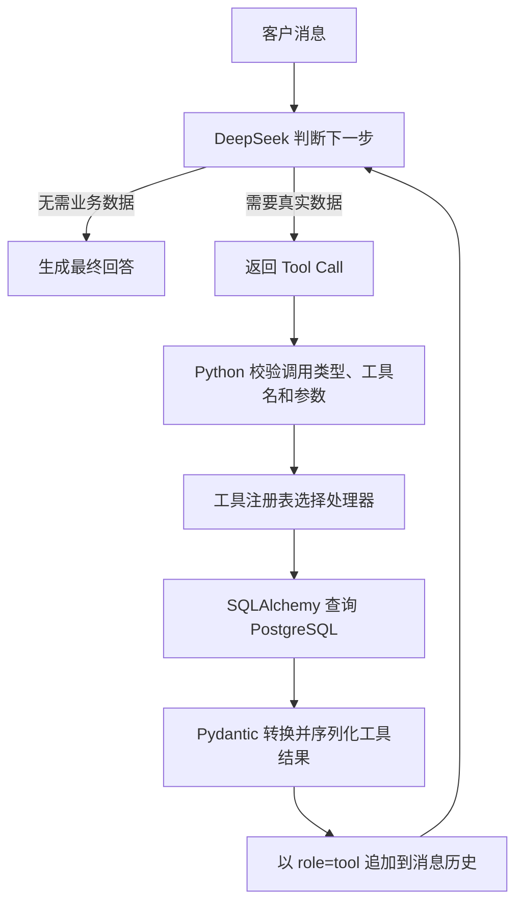
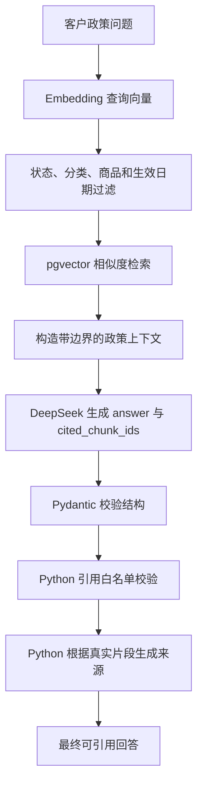

# ServiceFlow Agent

基于 FastAPI、DeepSeek Tool Calling、PostgreSQL 和 pgvector 实现的智能客服 Agent。它能够理解客户问题，自主选择订单或物流查询工具，也能检索售后政策并生成带可信来源的 RAG 回答。

## 当前功能

- 订单、商品和物流信息查询
- 客服工单创建、预览与查询
- 客户消息结构化意图识别
- DeepSeek Tool Calling
- 订单与物流多工具选择和执行
- 同一轮多个工具调用与连续多轮工具调用
- Pydantic 工具参数和结果校验
- 工具白名单与统一工具注册表
- 最大工具轮数限制
- DeepSeek、数据库连接、连接池和 SQL 执行超时
- Markdown 政策加载、章节切分与幂等向量索引
- PostgreSQL + pgvector 语义检索
- 关键词与向量 RRF 混合检索实验
- 带结构化引用、白名单校验和可信来源的 RAG 回答
- Prompt Injection、政策状态、版本和生效日期安全检查
- 20 篇模拟政策、80 个章节片段和 20 条检索评测
- pytest 自动化测试

## 技术栈

- Python 3.13
- FastAPI、Uvicorn
- Pydantic、Pydantic Settings
- DeepSeek V4 Flash（OpenAI 兼容 API）
- SQLAlchemy 2、Psycopg 3
- PostgreSQL 17
- pgvector、Sentence Transformers
- `BAAI/bge-small-zh-v1.5` 中文 Embedding 模型
- Docker Compose
- pytest
- uv

## Agent 工作流程



大模型只负责理解问题、选择工具和组织回答。工具参数校验、数据库访问、状态映射、总价计算、超时、错误处理和循环限制均由 Python 后端负责。

## RAG 工作流程



知识文档始终被视为不可信数据。模型不能直接决定政策是否生效，也不能自行生成可信来源；政策过滤、引用范围和来源格式均由 Python 确定性执行。

## 项目结构

```text
agent_service.py       Agent 多轮循环、工具编排和异常转换
agent_tools.py         业务工具、工具适配器和工具注册表
llm_service.py         DeepSeek 客户端、工具 Schema 和意图识别
llm_models.py          意图、Agent 请求响应及工具参数结果模型
api.py                 FastAPI 路由
models.py              Pydantic 业务模型
db_models.py           SQLAlchemy ORM 表模型
database.py            PostgreSQL Engine 和超时配置
seed_data.py           幂等测试数据初始化
compose.yaml           PostgreSQL 本地开发环境
policy_loader.py       Markdown政策加载和章节切分
policy_indexer.py      Embedding生成与幂等向量索引
database_vector_retriever.py  pgvector语义检索与元数据过滤
hybrid_retriever.py    关键词和向量RRF融合实验
rag_service.py         RAG上下文、结构化回答、引用校验和格式化
rag_models.py          政策、评测和RAG回答模型
knowledge/policies/    20篇模拟售后政策
evaluation/            检索、回答和安全验收资料
tests/                 自动化测试
```

根目录中的 `*_demo.py` 是分阶段学习和手工验证代码，不属于正式 API 调用链。

## 本地运行

### 1. 准备环境

需要安装：

- Python 3.13+
- [uv](https://docs.astral.sh/uv/)
- Docker Desktop 或其他兼容 Docker Compose 的容器运行时

安装项目依赖：

```bash
uv sync
```

### 2. 配置 DeepSeek

复制配置模板：

```bash
cp .env.example .env
```

在 `.env` 中填写真实密钥：

```dotenv
DEEPSEEK_API_KEY=your-api-key
DEEPSEEK_BASE_URL=https://api.deepseek.com
DEEPSEEK_MODEL=deepseek-v4-flash

DEEPSEEK_TIMEOUT_SECONDS=30
DEEPSEEK_MAX_RETRIES=2

DATABASE_CONNECT_TIMEOUT_SECONDS=5
DATABASE_POOL_TIMEOUT_SECONDS=5
DATABASE_STATEMENT_TIMEOUT_MS=5000
```

`.env` 已被 Git 忽略，不要提交或公开真实 API Key。

### 3. 启动 PostgreSQL

```bash
docker compose up -d
docker compose ps
```

本地开发数据库配置：

```text
Host: localhost
Port: 5432
Database: agent_study
User: agent
Password: agent_password
```

### 4. 建表和初始化数据

```bash
uv run python database.py
uv run python seed_data.py
uv run python policy_indexer.py
```

初始化程序具有幂等性，重复执行不会重复插入已有订单、商品、物流和未变化的政策片段。

### 5. 启动 API

```bash
uv run uvicorn api:app --reload
```

服务地址：

- API：<http://127.0.0.1:8000>
- Swagger：<http://127.0.0.1:8000/docs>
- OpenAPI JSON：<http://127.0.0.1:8000/openapi.json>

## API 接口

| 方法 | 路径 | 功能 |
|---|---|---|
| `GET` | `/health` | 服务健康检查 |
| `GET` | `/orders/{order_id}` | 查询订单 |
| `GET` | `/products/{product_id}` | 查询商品 |
| `GET` | `/logistics/{order_id}` | 查询物流 |
| `POST` | `/tickets/preview` | 校验并预览工单 |
| `POST` | `/tickets` | 创建工单 |
| `GET` | `/tickets/{ticket_id}` | 查询工单 |
| `POST` | `/agent/intent` | 识别客户消息意图 |
| `POST` | `/agent/chat` | 与智能客服 Agent 对话 |

Agent 请求示例：

```json
{
  "message": "帮我查询订单20260721001，并看看快递到哪里了"
}
```

## 测试

运行全部测试：

```bash
uv run python -m pytest -q
```

当前基线：

```text
113 passed
```

测试通过 Mock 隔离真实 DeepSeek 请求，不依赖网络、账户余额或模型输出的随机性。

检索评测：

```bash
uv run python evaluate_retrieval.py
```

当前知识库扩容基线为20篇政策、80个章节片段和20条问题，`Hit@5 = 19/20（95.00%）`。唯一失败是需要同时召回两类政策的多方面问题，相关条款位于第6名；该结果保留为后续查询拆分、多样化召回或 Reranker 的改进基线。

## 安全与可靠性

- API Key 通过环境配置注入，不写入源码或 Git
- 工具名称必须存在于显式注册表中
- 工具参数使用 Pydantic 校验并禁止额外字段
- 工具调用仅支持 SDK 的 Function Tool 类型
- 工具结果由 Python 转换成明确的业务语义
- Agent 最多执行 3 轮工具，避免无限循环和费用失控
- DeepSeek 请求具有超时和有限重试
- PostgreSQL 配置连接、连接池等待和语句执行超时
- 内部异常统一转换，对外返回稳定且不泄露实现细节的错误信息
- 日志不记录 API Key 和完整工具参数
- RAG政策上下文使用明确边界，并声明知识内容属于不可信数据
- 模型回答使用Pydantic结构化校验并禁止额外字段
- 模型引用编号必须属于本次检索结果白名单
- 最终引用名称、章节和来源由Python根据真实片段生成
- 只检索状态有效且已经生效的政策
- 索引同步跟踪正文、模型、版本、日期、状态和过滤元数据变化

## 后续计划

- 将混合检索或 Reranker 接入正式 RAG 流程
- 增加查询拆分和结果多样化，改善多政策问题召回
- 商品查询、退款资格检查和工单处理工具
- 使用 LangGraph 管理复杂客服工作流
- 写操作前的用户确认和人工升级
- 自动评测集、调用链追踪和成本统计
- Docker Compose 一键启动完整应用
